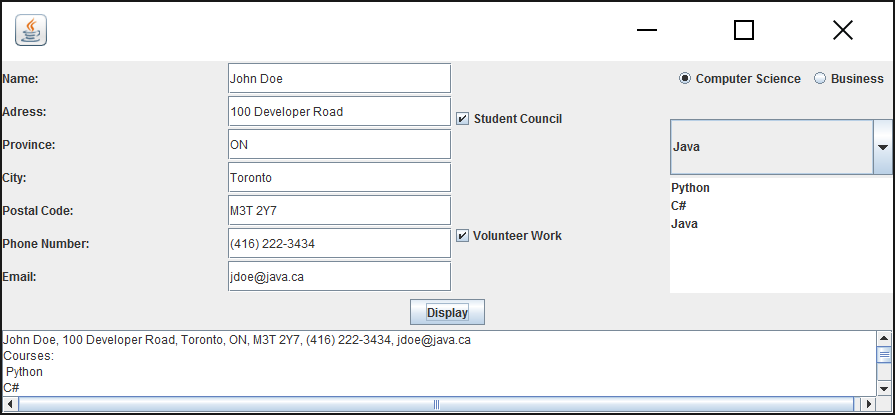

# LAB \#4 – Developing UI using JavaF

## Exercise 1

Write a Java application using JavaFx which allows the user to enter
student information (see the sample design below).

#### 

#### The user will enter *full* *name*, *address,* *city, province, postal code, phone number and email* in *text field* controls. The student’s *major* (Computer Science or Business) will be selected from two *radio buttons*. 

#### A combo box will display the list of *courses* for each program whenever the user selects the desired program.

#### A course will be added to a *list box w*henever the user selects a course from the corresponding combo box. Make sure that the user cannot add a course several times.

Additional information about the student will be provided from a group
of *check boxes* (such as involvement in various activities, etc).

All the information about the student will be displayed in a text *area*
component. Use simple JavaFX layout managers, such as FlowPane,
BorderPane, and GridPane to create the JavaFX GUI of this application.

(10 marks)

**Evaluation:**

<table>
<colgroup>
<col style="width: 50%" />
<col style="width: 49%" />
</colgroup>
<thead>
<tr class="header">
<th><strong>Functionality</strong></th>
<th></th>
</tr>
<tr class="odd">
<th><blockquote>

Correct implementation of UI

</blockquote></th>
<th>40%</th>
</tr>
<tr class="header">
<th><blockquote>

Correct implementation of event handling and display of results

</blockquote></th>
<th>40%</th>
</tr>
<tr class="odd">
<th><blockquote>

Comments, correct naming of variables, methods, classes, etc.

</blockquote></th>
<th>5%</th>
</tr>
<tr class="header">
<th><strong>Friendly input/output</strong></th>
<th>15%</th>
</tr>
<tr class="odd">
<th><strong>Total</strong></th>
<th>100%</th>
</tr>
</thead>
<tbody>
</tbody>
</table>
